# LiftSmart 💪

A lightweight, AI-powered fitness app built with React Native and Expo that helps users track workouts, set goals, and achieve their fitness objectives through personalized planning and intelligent suggestions.


## 🎯 Problem Statement

People want to reach their fitness goals but there's too much information online, and existing tools don't narrow down or personalize fitness information effectively. LiftSmart solves this by providing a focused, intelligent fitness tracking experience.

## ✨ Features

### 🔐 Authentication & User Management
- **Firebase Integration**: Secure user registration and authentication
- **Data Persistence**: Save and retrieve user schedules, workout data, and activity state
- **Fast Sign-in**: Authentication under 3 seconds

### 📅 Smart Scheduling System
- **Multi-view Calendar**: Month, week, and day views for comprehensive planning
- **Workout Management**: Create, edit, and delete workout blocks with detailed descriptions
- **Interactive Interface**: Intuitive design with confirmation dialogs for deletions
- **Fast Performance**: Calendar loads and displays under 5 seconds

### 🏋️ Activity Tracking & Workout Plans
- **Daily Todo Display**: Interactive bullet-point format for planned activities
- **Completion Tracking**: Mark activities complete with easy toggle functionality
- **Workout Plans**: Create and manage comprehensive workout routines
- **Exercise Library**: Add exercises with sets, reps, and custom details
- **Progress Monitoring**: Track workout intensity and performance metrics

### 🤖 AI-Powered Features
- **Smart Suggestions**: AI-powered fitness recommendations and planning
- **Personalized Guidance**: Tailored workout suggestions based on user goals
- **Fast Response**: AI suggestions load in under 10 seconds

### 📱 Modern Mobile Experience
- **Cross-Platform**: Built with React Native for iOS and Android
- **Responsive Design**: Optimized for mobile devices with haptic feedback
- **Intuitive UI**: Clean, modern interface following mobile design best practices

## 🛠️ Tech Stack

- **Frontend**: React Native, Expo
- **Navigation**: Expo Router
- **Authentication**: Firebase Auth
- **AI Integration**: OpenAI API
- **Calendar**: React Native Calendars
- **UI Components**: React Native Paper
- **State Management**: React Context API
- **Language**: TypeScript
- **Styling**: Custom styles with theming support

## 📱 App Structure

```
app/
├── (tabs)/           # Main tab navigation
│   ├── index.tsx     # Home/Dashboard
│   ├── plans.tsx     # Workout plans
│   ├── schedule.tsx  # Calendar & scheduling
│   ├── workout.tsx   # Active workout
│   └── settings.tsx  # User settings
├── screens/          # Authentication screens
└── _layout.tsx       # Root layout

components/
├── plans/            # Workout plan components
├── chat/             # AI chatbot components
├── ui/               # Reusable UI components
└── styles.ts         # Global styles
```

## 🎨 Design Philosophy

- **Lightweight**: Focused on essential fitness tracking features
- **Personalized**: AI-driven recommendations tailored to individual goals
- **Intuitive**: Simple, clean interface that's easy to navigate
- **Fast**: Optimized performance for smooth user experience
- **Accessible**: Designed for users of all fitness levels

## 📥 Download

- [Download LiftSmart APK](liftSmart-apk/liftSmart.apk)

## 📸 Screenshots

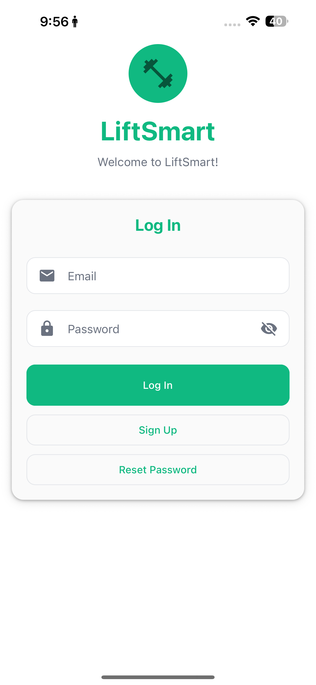
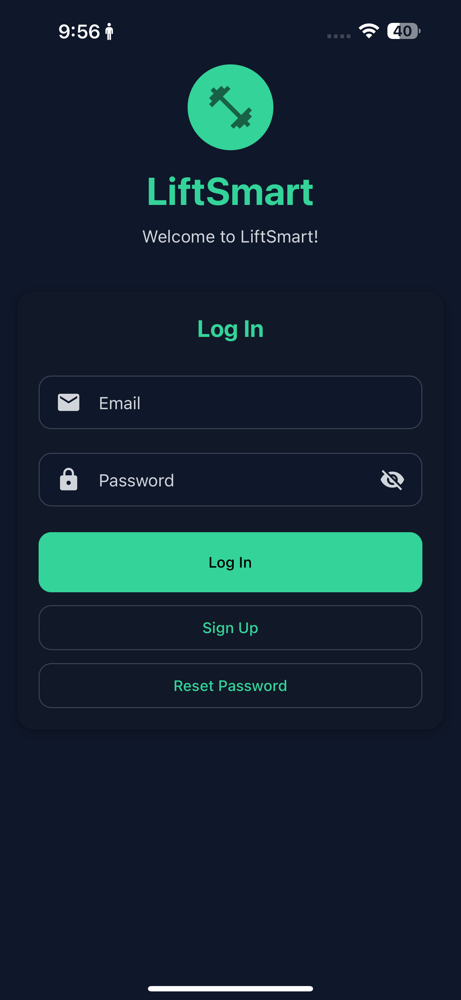
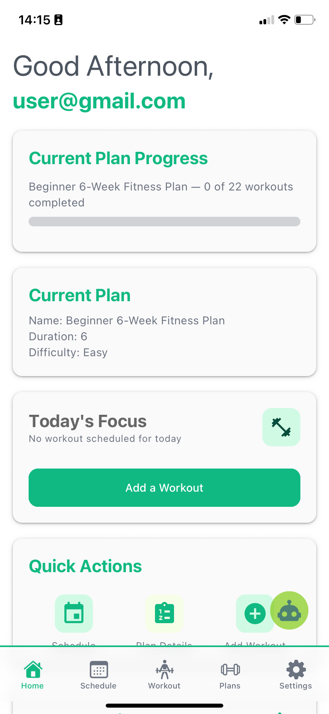
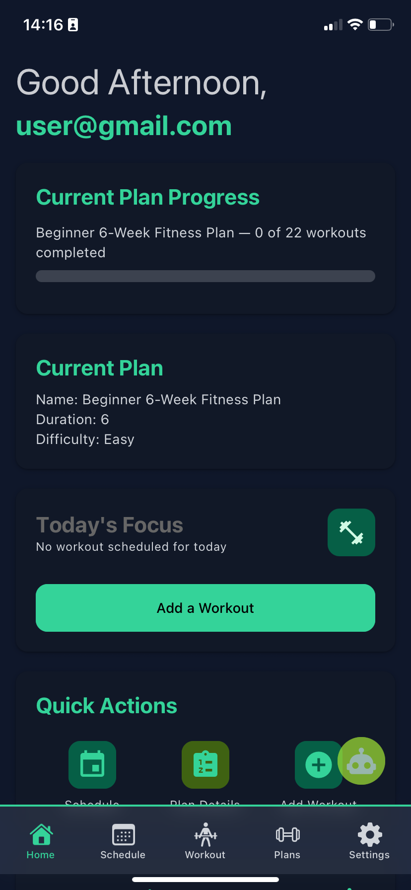
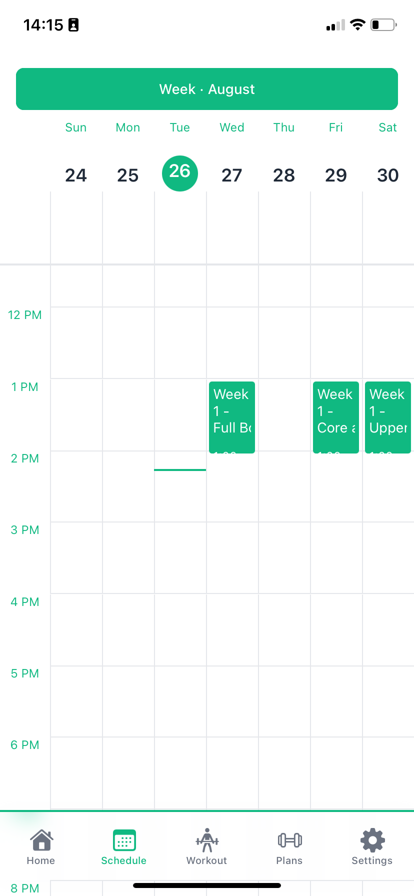
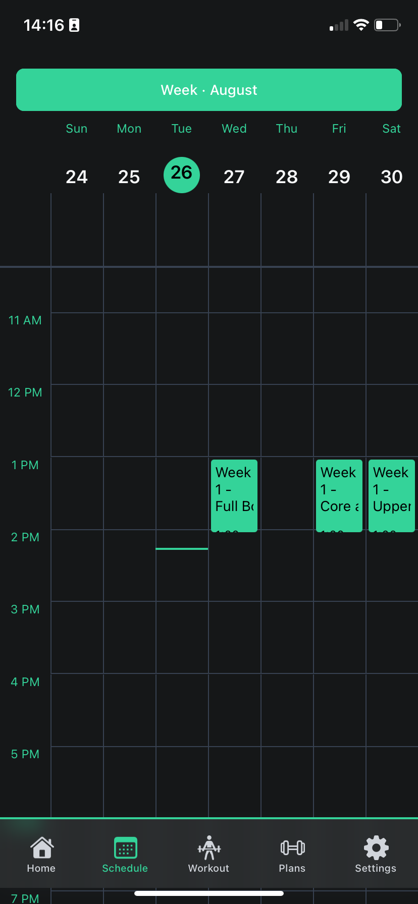
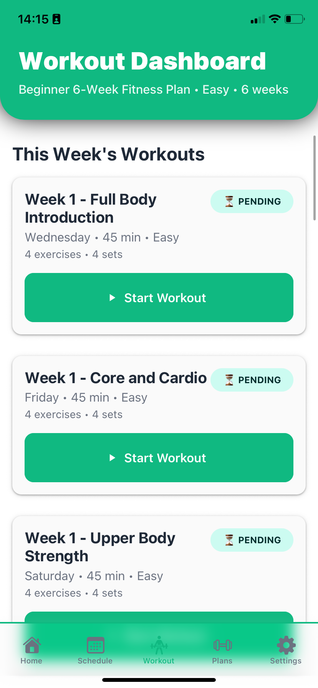
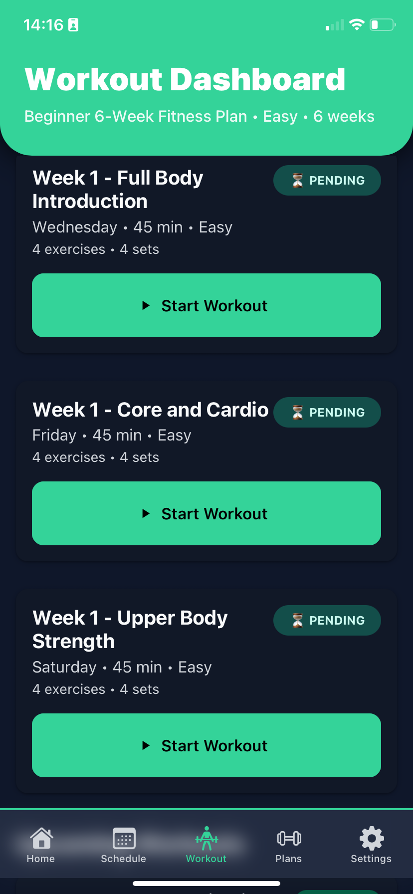
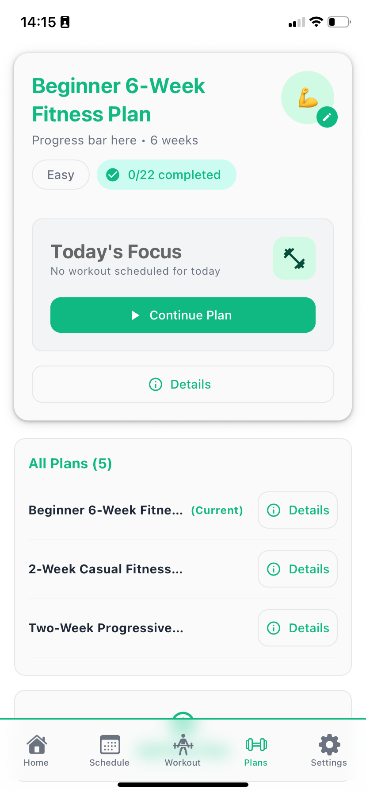

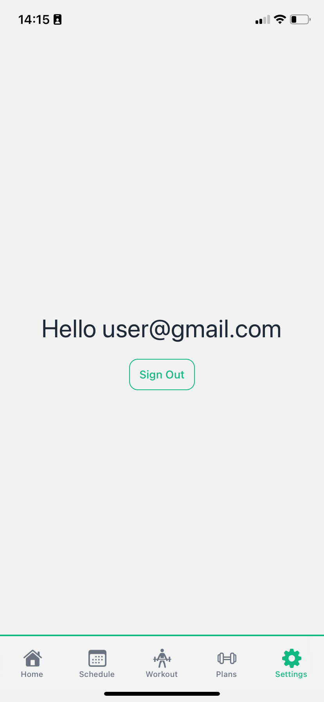
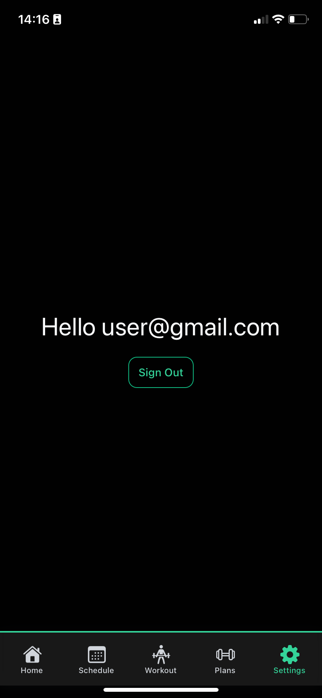


